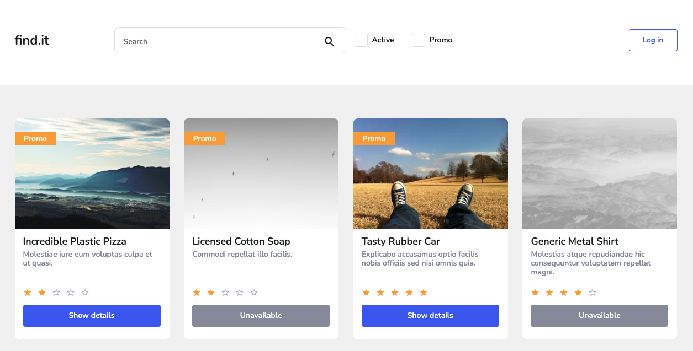

# React Product App Task

## :technologist: Technologies and metodologies

Technologies and metodologies used in this project:

**React / Typescript / SCSS / API / BEM / RWD**

#### :clapper: Check live version: **[LIVE](https://react-interview-starter-ts-rafalkazik.vercel.app/)**

This is my first project using TypeScript. I finally wanted to use it because so far I only used JavaScript.

The project doesn't include tests in React, because I am planning to learn them in the near future. I wanted to focus mainly on TypeScript.

## :gear: Installation

Let's start with installing all dependencies. Move to the app main workspace and run:

    npm i

To create a localhost port you should type:

    npm start

Our repositories search engine is ready at port 3000.

    http://localhost:3000/

## :microscope: How it works?

Enter the name of the product you are interested in.

If the product is not on the list, appropriate information will be displayed.

Filter promotional or available products.

View product details.

